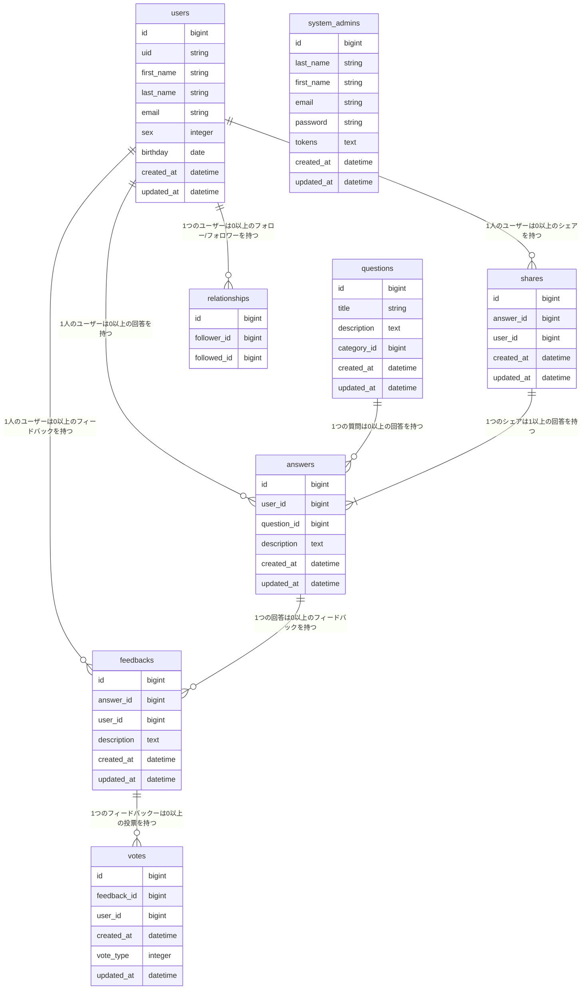

# cross-coaching

- コーチングSNS
- 2022/12/30〜設計スタート

# 環境構築手順

### ER図

```mermaid
erDiagram
users ||--o{ answers : "1人のユーザーは0以上の回答を持つ"
users ||--o{ shares : "1人のユーザーは0以上のシェアを持つ"
users ||--o{ feedbacks : "1人のユーザーは0以上のフィードバックを持つ"
questions ||--o{ answers : "1つの質問は0以上の回答を持つ"
shares ||--|{ answers : "1つのシェアは1以上の回答を持つ"
answers ||--o{ feedbacks : "1つの回答は0以上のフィードバックを持つ"
users ||--o{ relationships : "1つのユーザーは0以上のフォロー/フォロワーを持つ"
feedbacks ||--o{ votes : "1つのフィードバックーは0以上の投票を持つ"


system_admins {
  id bigint
  last_name string
  first_name string
  email string
  password string
  tokens text
  created_at datetime
  updated_at datetime
}

users {
  id bigint
  uid string
  first_name string
  last_name string
  email string
  sex integer
  birthday date
  created_at datetime
  updated_at datetime
}

questions {
  id bigint
  title string
  description text
  category_id bigint
  created_at datetime
  updated_at datetime
}

answers {
  id bigint
  user_id bigint
  question_id bigint
  description text
  created_at datetime
  updated_at datetime
}

shares {
  id bigint
  answer_id bigint
  user_id bigint
  created_at datetime
  updated_at datetime
}

feedbacks {
  id bigint
  answer_id bigint
  user_id bigint
  description text
  created_at datetime
  updated_at datetime
}

votes {
  id bigint
  feedback_id bigint
  user_id bigint
  created_at datetime
  vote_type integer
  updated_at datetime
}

relationships {
  id bigint
  follower_id bigint
  followed_id bigint
}
```
